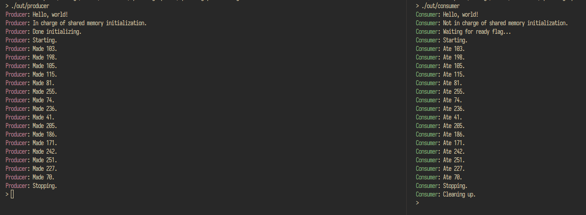
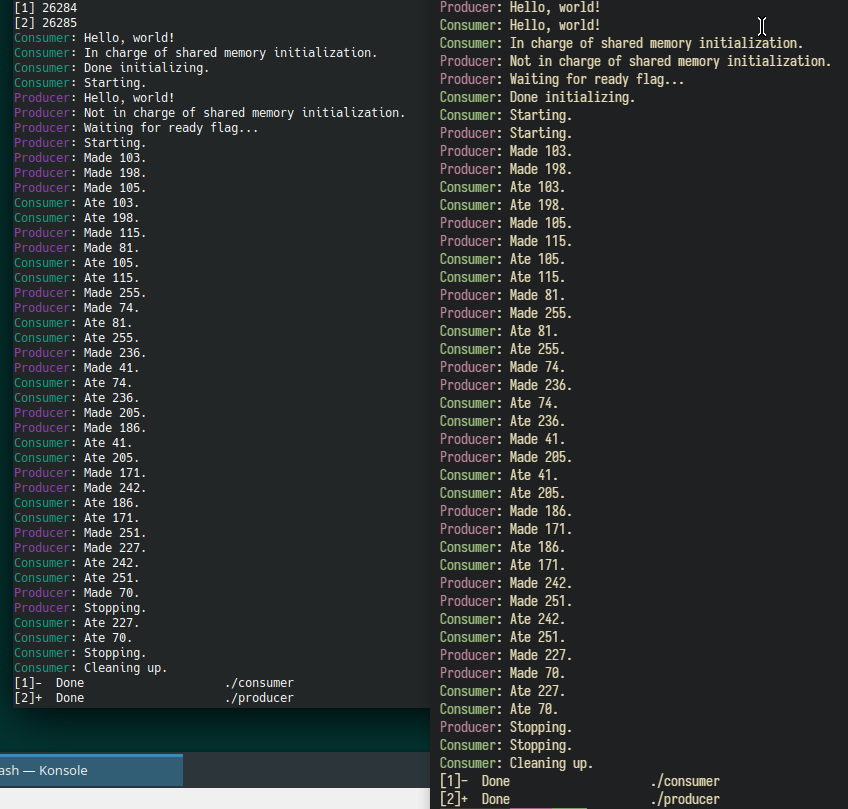

Lynne Wheatley  
Operating Systems  
Assignment 1

# Producer-Consumer Problem

This consists of two C programs -- one a Producer, and the other a Consumer. The Producer creates integers, and the Consumer consumes them. They're both separate programs that communicate using POSIX shared memory.

I used three semaphores to allow for an unlimited number of producers and consumers, and I also used `O_EXCL` along with a carefully-prepared spinlock to determine which singular process is in charge of initializing the table at runtime. For more information, look at the comment in `shared_table.h` about the `isReady` field on the shared memory table.





## Project Layout

The `src` folder contains all the source code.

- `producer.c` & `consumer.c` - There they are!
- `process_sync.h` - Utility functions for setting up the shared-memory "Table".
- `shared_memory.h` - The Table itself.
- `test_*.c` - Some prototypes I wrote to build understanding of POSIX shared memory objects and semaphores.

There are also two basic build scripts.

- `build.sh` - Builds the producer & consumer binaries along with the prototypes, and puts them all in an `out` folder.
- `clean.sh` - Destroys the `out` folder.

## Requirements

Here's a reinterpretation of the requirements document, in Markdown.

> ### Requirements
> 
> In this programming assignment, you must provide the source codes, documents, and examples in detail on Github. They will be counted for the final score. Please submit the link to the project on Github.
> 
> Requirements:
> - Use C/C++ in Linux. Consider installing VirtualBox if you don't use Linux.
> - Programs should work. (80 points)
> - Readme, Documentation, and Examples are required. (20 Points)
> 
> The producer generates items and puts items onto the table. The consumer will pick up items. The table can only hold two items at the same time. When the table is complete, the producer will wait. When there are no items, the consumer will wait. We use semaphores to synchronize producer and consumer. Mutual exclusion should be considered. We use threads in the producer program and consumer program. Shared memory is used for the “table”.
> 
> Once built, we expect to use these two programs (producer and consumer) like this:
> 
> ```shell
> $ ./producer & ./consumer &
> ```
>
> ### Hints
>
> - Shared Memory
>   - You need shared memory to build the buffer accessible by two processes.
>   - Yes, two processes.
>   - [The `man` page for `shm_open`](https://man7.org/linux/man-pages/man3/shm_open.3.html).
> - Mutual Exclusion
>   - Simply use [a Semaphore](https://www.geeksforgeeks.org/use-posix-semaphores-c/).
>
> Good luck!

## What I'm Using

<!-- I'm&zwnj;~~... not~~ using C in Linux! I'm using ~~MSYS2~~ *WSL2* to build and run these programs. ~~Despite this,~~ I'm ~~still~~ using bash, ~~still~~ using gcc, ~~still~~ using pthreads. It ~~should~~ work ~~the exact same~~ on Linux. -->

I'm using C in Linux! I'm using [*WSL2*](https://docs.microsoft.com/en-us/windows/wsl/) to build and run these programs. I'm using bash, using gcc, using POSIX shared memory. It work on Linux. [sic]

> As of 2025, I'm running Linux as my main operating system of choice. I was able to build this just fine on my installation of openSuSE Tumbleweed.

Run `build.sh`. It will create the `out` folder, which will contain the binaries. Inside that folder, simply do...

```shell
./producer & ./consumer & sleep 2s
```

> It's also sufficient to just call each one on your own time! Both the processes can and will wait until they have things to produce/consume!

...and it should output something like the following:

```shell
[1] pid1
[2] pid2
Producer: Hello, world!
Consumer: Hello, world!
Producer: In charge of shared memory initialization.
Producer: Done initializing.
Consumer: Not in charge of shared memory initialization.
Producer: Starting.
Producer: Made 103.
Consumer: Waiting for ready flag...
Producer: Made 198.
Producer: Made 105.
Consumer: Starting.
Consumer: Ate 103.
...
Consumer: Ate 242.
Producer: Made 70.
Producer: Stopping.
Consumer: Ate 251.
Consumer: Ate 227.
Consumer: Ate 70.
Consumer: Stopping.
Consumer: Cleaning up.
[1]-  Done                    ./producer
[2]+  Done                    ./consumer
```

The numbers and order will be random, but there will be the same amount of corresponding `Made %d` and `Ate %d` messages.

### A more advanced example (2025)

This creates four processes, and as you can see, this solution is robust enough to handle situations like this.

```bash
$ ./out/producer & ./out/producer & ./out/consumer & ./out/consumer
[1] <pid 2>
[2] <pid 3>
[3] <pid 4>
Producer: Hello, world!
Producer: In charge of shared memory initialization.
Producer: Hello, world!
Producer: Not in charge of shared memory initialization.
Producer: Done initializing.
Producer: Starting.
Producer: Made 103.
Producer: Made 198.
Producer: Made 105.
Producer: Waiting for ready flag...
Producer: Starting.
Producer: Made 103.
Consumer: Hello, world!
Consumer: Not in charge of shared memory initialization.
Consumer: Waiting for ready flag...
Consumer: Starting.
Consumer: Ate 103.
Consumer: Ate 198.
Producer: Made 115.
Consumer: Ate 105.
Producer: Made 198.
Producer: Made 81.
Consumer: Ate 103.
Producer: Made 105.
Consumer: Ate 115.
Producer: Made 255.
Producer: Made 74.
Consumer: Ate 198.
Consumer: Ate 81.
Producer: Made 115.
Producer: Made 81.
Consumer: Ate 255.
Consumer: Ate 105.
Producer: Made 255.
Producer: Made 236.
Consumer: Ate 115.
Consumer: Ate 81.
Consumer: Ate 74.
Producer: Made 74.
Consumer: Ate 255.
Producer: Made 236.
Producer: Made 41.
Consumer: Ate 74.
Producer: Made 41.
Consumer: Ate 236.
Producer: Made 205.
Consumer: Ate 236.
Producer: Made 205.
Consumer: Stopping.
Consumer: Hello, world!
Consumer: Not in charge of shared memory initialization.
Consumer: Waiting for ready flag...
Consumer: Starting.
Consumer: Ate 41.
Producer: Made 186.
Producer: Made 171.
Consumer: Ate 41.
Consumer: Ate 205.
Producer: Made 242.
Producer: Made 251.
Consumer: Ate 186.
Producer: Made 186.
Consumer: Ate 171.
Producer: Made 171.
Consumer: Ate 242.
Consumer: Ate 205.
Producer: Made 227.
Producer: Made 70.
Consumer: Ate 186.
Consumer: Ate 251.
Producer: Stopping.
Consumer: Ate 227.
Producer: Made 242.
Consumer: Ate 70.
Producer: Made 251.
Consumer: Ate 171.
Producer: Made 227.
Consumer: Ate 242.
Producer: Made 70.
Consumer: Ate 251.
Producer: Stopping.
Consumer: Ate 227.
Consumer: Ate 70.
Consumer: Stopping.
Consumer: Cleaning up.
[1]   Done                       ./out/producer
[2]-  Done                       ./out/producer
[3]+  Done                       ./out/consumer
$
```

## Resources Used

- I extensively used the man pages `sem_overview` and `shm_overview`.

<!--## Web resources too

- https://www.cs.cmu.edu/afs/cs/academic/class/15492-f07/www/pthreads.html oh thank god for this
- https://man7.org/linux/man-pages/man0/unistd.h.0p.html
- https://man7.org/linux/man-pages/man0/pthread.h.0p.html -->
